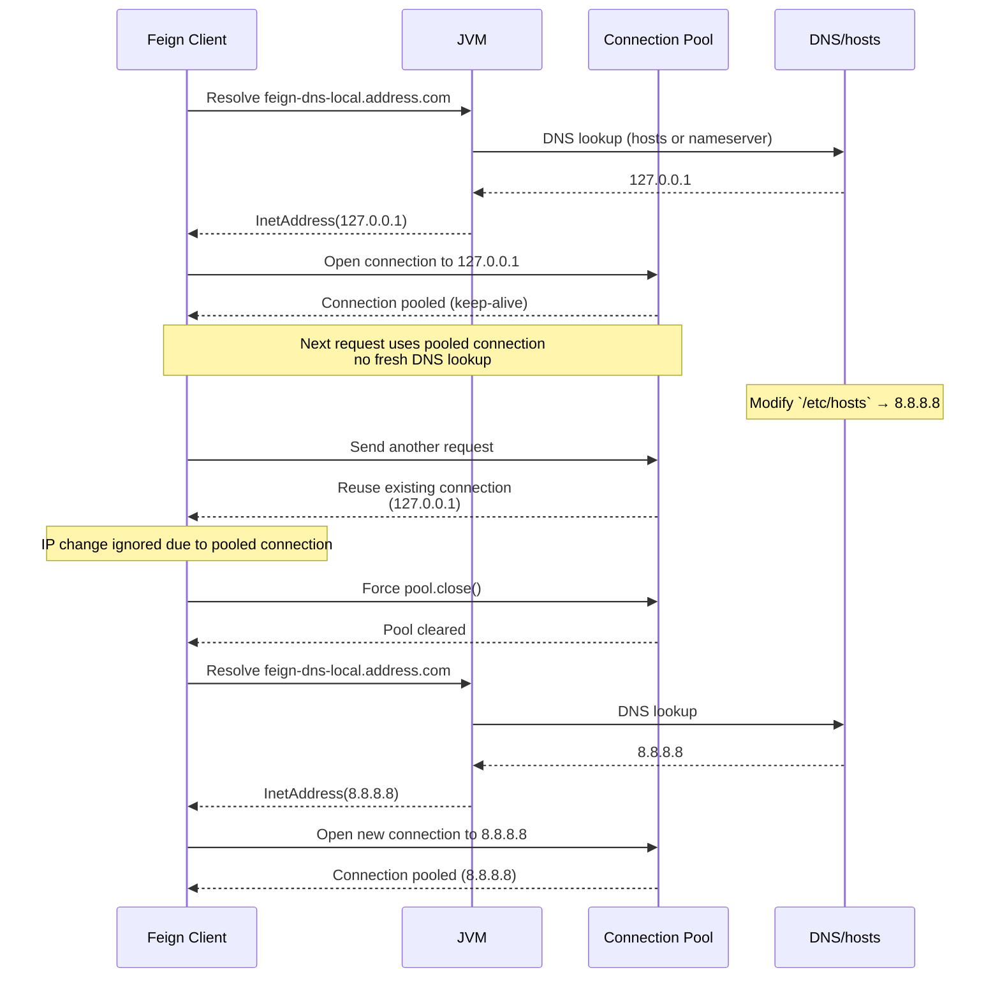

# [Test-Module] feign-dns-lookup-issue
## Blog Post
- [ENG] (https://medium.com/@jaethon96/how-is-dns-managed-in-jvm-0b1cadd08ba2)
- [KOR] (https://rojae.github.io/posts/jvm-dns-caching-meets-connection-pools/)

# Environment

- Java 21
- Spring Boot 3.5.3
- Spring Cloud 2025.0.0

---

# How to Run

## 1. Set `feign-dns-local.address.com` in `/etc/hosts`

```sh
sudo vi /etc/hosts

# Feign Clients DNS Local Test
127.0.0.1       feign-dns-local.address.com
#8.8.8.8        feign-dns-local.address.com
```

## 2. For testing and tracking, modify the JVM network TTL settings in `java.security`

You can check the current settings:

```sh
cat $JAVA_HOME/conf/security/java.security | grep ttl
```

Then modify as shown below:

```properties
#networkaddress.cache.ttl=-1
# CUSTOM Value "positive ttl"
networkaddress.cache.ttl=0
#networkaddress.cache.negative.ttl=10
# CUSTOM Value "negative ttl"
networkaddress.cache.negative.ttl=0
```

### Note:

- `networkaddress.cache.ttl` and `networkaddress.cache.negative.ttl`
    - 0 : **no caching** — the JVM performs a fresh DNS lookup on every request
    - -1 : **permanent caching** — cached values are retained until the JVM restarts
    - positive value (>0) : **caching for the specified number of seconds**, after which the name will be re-resolved

---

## 3. Run Application Server

When running `sender-server`, add this JVM option:

```shell
--add-exports java.base/sun.net=ALL-UNNAMED
```

__AND__ simply run `receiver-server` as usual.

---

## 4. Expected `Scenario`



---

# Reference

## Standard JVM `networkaddress.cache.*` Properties with Java version

| Property                            | Description                                                                       | Default | Java Version Introduced | Status     | Java Proposal Reference                                                                                                                                                                                                                                               |
|-------------------------------------|-----------------------------------------------------------------------------------|---------|-------------------------|------------|-----------------------------------------------------------------------------------------------------------------------------------------------------------------------------------------------------------------------------------------------------------------------|
| `networkaddress.cache.ttl`          | Positive cache TTL (seconds) for successful name resolutions. `-1` means forever. | `-1`    | JDK 1.4+                | Standard   | introduced in JDK 1.4, no JEP (java.security standard)                                                                                                                                                                                                                |
| `networkaddress.cache.negative.ttl` | Negative cache TTL (seconds) for failed name resolutions. `-1` means forever.     | `10`    | JDK 1.4+                | Standard   | introduced in JDK 1.4, no JEP (java.security standard)                                                                                                                                                                                                                |
| `networkaddress.cache.stale.ttl`    | TTL (seconds) for allowing stale (expired) cache reuse if fresh lookup fails.     | `0`     | JDK 17+                 | Standard   | [JDK-8306653 (Reuse stale data to improve DNS resolver resiliency)](https://bugs.openjdk.org/browse/JDK-8306653) AND [Oracle-Docs Java-24](https://docs.oracle.com/en/java/javase/24/docs/api/java.base/java/net/doc-files/net-properties.html#address-cache-heading) |
| `sun.net.inetaddr.ttl`              | Legacy alias for positive TTL (same as `networkaddress.cache.ttl`).               | n/a     | pre-JDK 1.4             | Deprecated | no JEP                                                                                                                                                                                                                                                                |
| `sun.net.inetaddr.negative.ttl`     | Legacy alias for negative TTL (same as `networkaddress.cache.negative.ttl`).      | n/a     | pre-JDK 1.4             | Deprecated | no JEP                                                                                                                                                                                                                                                                |

## Shutdown OS Cache

| OS          | Command                                                             | Description                                |
|-------------|---------------------------------------------------------------------|--------------------------------------------|
| **macOS**   | `sudo killall -HUP mDNSResponder`                                   | Flush macOS DNS cache immediately          |
| **Linux**   | `sudo systemd-resolve --flush-caches`<br>OR<br>`sudo nscd -i hosts` | Flush Linux systemd-resolved or nscd cache |
| **Windows** | `ipconfig /flushdns`                                                | Flush Windows DNS client cache             |

## Reference Links

### Oracle Docs

- [Oracle-Docs Java-24](https://docs.oracle.com/en/java/javase/24/docs/api/java.base/java/net/doc-files/net-properties.html#address-cache-heading)
- [Oracle-Docs Java-17](https://docs.oracle.com/en/java/javase/17/docs/api/java.base/java/net/doc-files/net-properties.html)
- [Oracle-Docs Java-11](https://docs.oracle.com/en/java/javase/11/docs/api/java.base/java/net/doc-files/net-properties.html)
- [Oracle-Docs Java-8](https://docs.oracle.com/javase/8/docs/technotes/guides/net/properties.html)

### Open JDK

- [JDK-8306653 (Reuse stale data to improve DNS resolver resiliency)](https://bugs.openjdk.org/browse/JDK-8306653)
- [JDK-8219993 (OpenJDK bug)](https://bugs.openjdk.org/browse/JDK-8219993)
- [JDK-8323089 (OpenJDK bug)](https://bugs.openjdk.org/browse/JDK-8323089)

### RFC

- [RFC-8767 (Serving Stale Data to Improve DNS Resiliency)](https://www.rfc-editor.org/rfc/rfc8767)
