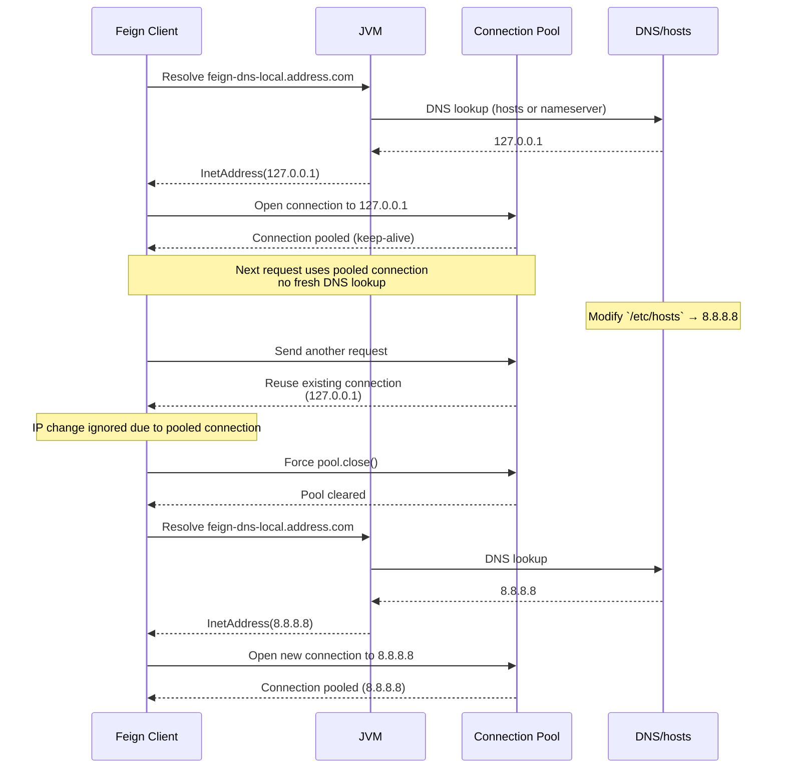

# [Test-Module] feign-dns-lookup-issue

# Environment
- java 21
- springboot 3.5.3
- spring cloud 2025.0.0

---

# How to Run
## 1. Set `feign-dns-local.address.com` in `/etc/hosts`
```sh
vi /etc/hosts

# Feign Clients Dns Local Test
127.0.0.1       feign-dns-local.address.com
#8.8.8.8         feign-dns-local.address.com
```

## 2. For Tracking Test, Modify JVM Network TTL in (`java.security`)
This file `java.security`
```shell
cat $JAVA_HOME/conf/security/java.security | grep ttl
```

For Tracking test, _**Modify** `java.security`_

Below Like this
```shell
#networkaddress.cache.ttl=-1
# CUSTOM Value "positive ttl"
networkaddress.cache.ttl=0

#networkaddress.cache.negative.ttl=10
# Custom Value "negative ttl"
networkaddress.cache.negative.ttl=0
```

---

## 3. Run Application Server
For Running `sender-server` JVM option.
```shell
--add-exports java.base/sun.net=ALL-UNNAMED
```

__AND__ Simply just run `receiver-server`

---

## 4. Excepted `Scenario`


---

# Reference

## Website
- https://bugs.openjdk.org/browse/JDK-8219993
 
## Shutdown OS Cache

| OS          | 명령어                                                                 | 설명                                     |
|-------------|---------------------------------------------------------------------|----------------------------------------|
| **macOS**   | `sudo killall -HUP mDNSResponder`                                   | macOS DNS 캐시를 즉시 플러시                   |
| **Linux**   | `sudo systemd-resolve --flush-caches`<br>또는<br>`sudo nscd -i hosts` | Linux의 systemd-resolved 또는 nscd 캐시 초기화 |
| **Windows** | `ipconfig /flushdns`                                                | Windows DNS 클라이언트 캐시 초기화               |
